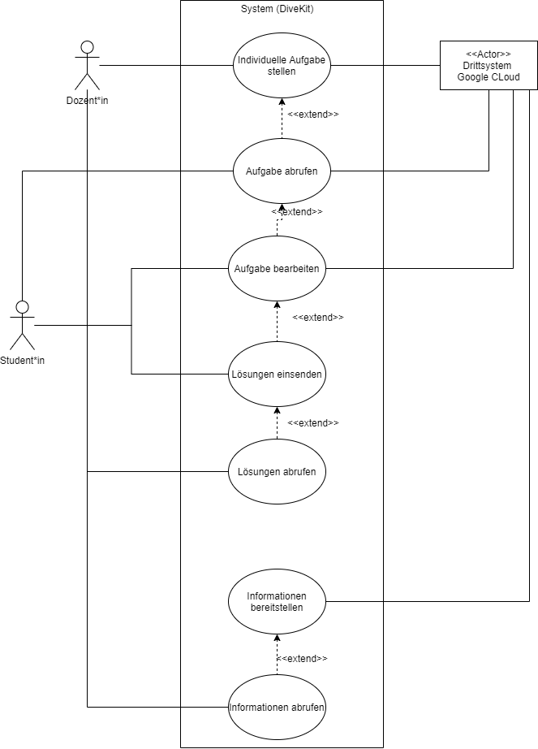

## Beschreibung

Das Use Case Diagramm stellt einige Nutzungsmöglichkeiten für die funktionale Anforderung "API" dar.

Enthalten sind die folgenden Use Cases:
* Individuelle Aufgaben stellen
* Informationen bereitstellen
* Informationen abrufen
* Lösungen bereitstellen
* Lösungen abrufen
* Lösungen einreichen

## Diagram

