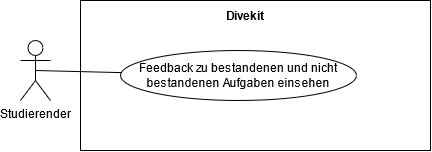

## Beschreibung

Das Use Case Diagramm stellt einige Nutzungsmöglichkeiten für die funktionale Anforderung "Allgemeines Feedback" dar.

Enthalten sind die folgenden Use Cases:
* Feedback zu bestandenen und nicht bestandenen Aufgaben einsehen

## Diagram

