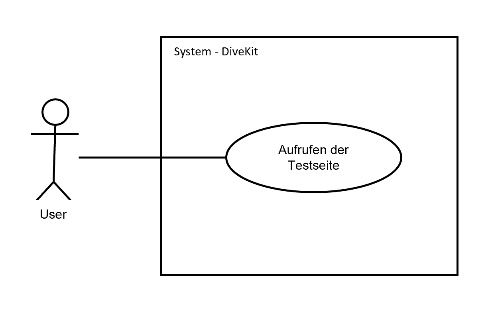

## Beschreibung

Der User, explizit eine studierende Person, kann mit dem System interagieren, um die Deadline jeder abzugebenden Aufgabe
anzeigen zu lassen.

Da es sich hierbei um keine Funktionalität handelt, die vom User änderbar ist, fällt dieses Diagramm klein aus.

## Diagram

