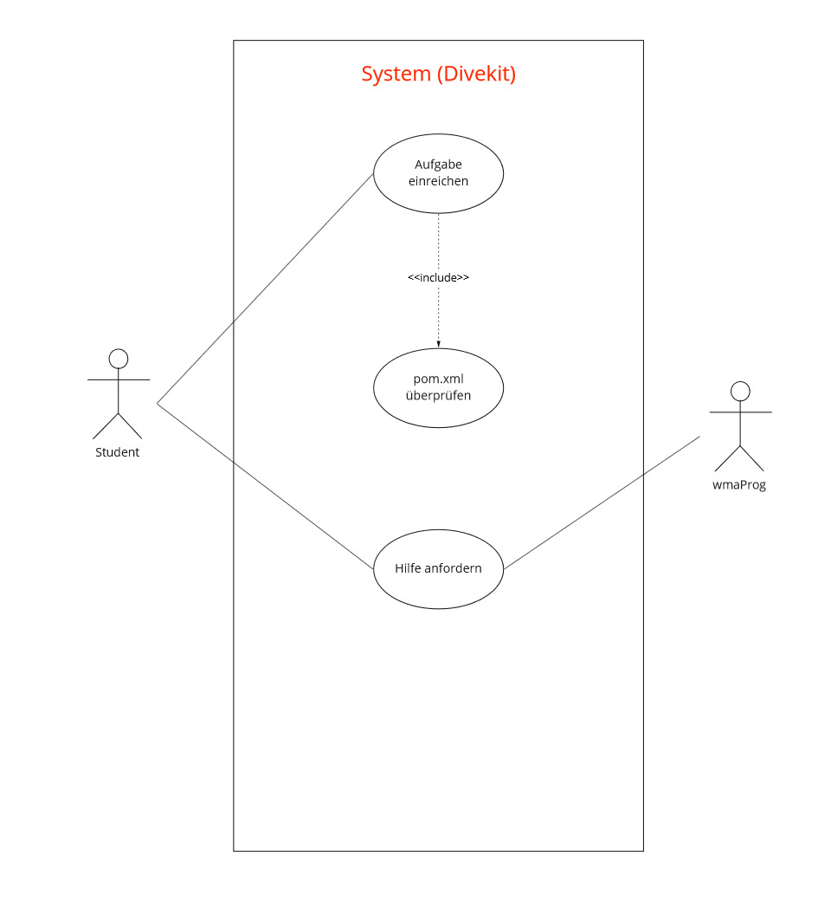

## Beschreibung

Hier werden mögliche Interaktionen mit dem System dargestellt, die mit der Anforderung "Aussagekräftige Fehlermeldung"
in Verbindung stehen. 

Der Use Case "Aufgabe testen" wird vom Studenten ausgeführt, um seine Aufgaben überprüfen zu lassen. Es soll eine 
Rückmeldung geben, ob die Aufgabe richtig/falsch ist oder ob der Test derzeit nicht durchführbar ist.

Der Use Case Prüfungsstatus erlaubt es dem Nutzer einzusehen, in welchem Zustand die Prüfung einer Aufgabe ist. Wenn die
Prüfung vom System nicht durchführbar ist, wird hier der Systemfehler kommuniziert.

Wenn so ein Fehler auftritt, kann der Nutzer sofort einen Bug-Report rausschicken, der an die Entwickler vom Divekit
gesendet wird. 

## Diagram

