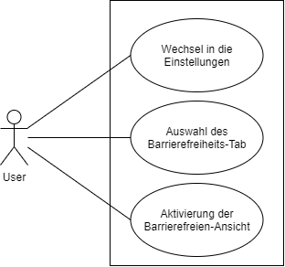

## Beschreibung

Der User, welcher für alle Personen gilt, welche mit dem System interagieren, kann die Einstellung für die Barrierefreiheit ändern. Ein weiterer Use Case zur Überprüfung der Änderung ist obsolet.

Daher fällt dieses Diagramm klein aus, weil der Use Case weder zu groß, noch zu fein granular ist.

## Diagram

