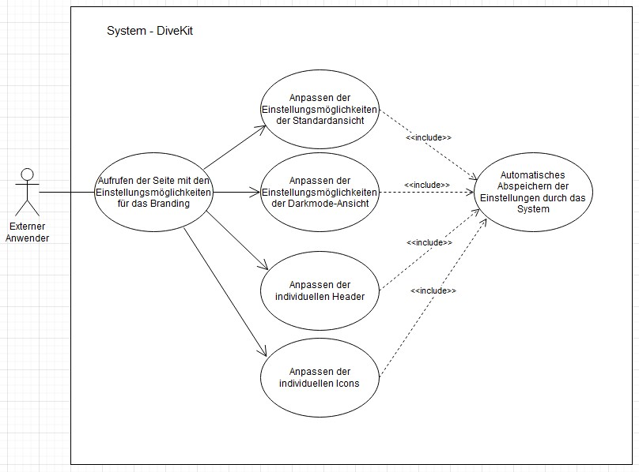

## Beschreibung

Dieses Usecase-Diagramm stellt die Interaktionen eines hochschulexternen Anwenders dar, die für die Änderung des Brandings relevant sind.

Dabei kann der externe Anwender nach dem Aufrufen der Seite mit den Einstellungsmöglichkeiten für das Branding drei verschiedene Anpassungen vornehmen und das Design des Systems and das Branding seiner Hochschule anzupassen.
* Anpassen der Stylesheets für die farbliche Gestaltung der graphischen Oberfläche für die drei verschiedenen Ansichten Standard, Darkmode und Barrierearm
* Anpassen von individuellen Headern
* Hochladen individueller Icons

Nach dem Anpassen der entsprechenden Einstellungsmöglichkeit wird die Änderung abgespeichert.

Voraussetzung für das Aufrufen dieser Einstellungsmöglichkeiten ist ein Login in das System mit der entsprechenden Berechtigung, beispielsweise als Verwalter.

## Diagram

