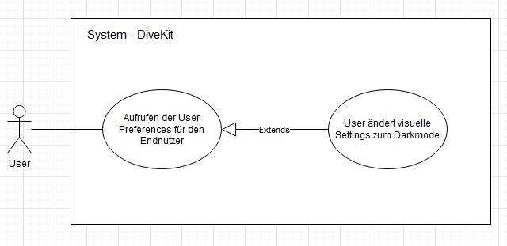

## Beschreibung

Dieses Usecase-Diagramm stellt die beiden Interaktionen des Nutzers dar, die für die funktionale Anforderung _Darkmode_ auftreten können. Als Nutzer gilt in diesem Usecase jeder Stakeholder, welcher mit dem System interagiert.  

Die beiden Aktionen "User ändert visuelle Settings zum Darkmode" und "User entscheidet sich gegen die Änderung der visuellen Settings", welche in diesem Usecase nach der Aktion "Aufrufen der Seite mit den visuellen Einstellungen" durchgeführt werden können, werden von jedem Nutzer ausgeführt, der den Wunsch verspürt seine visuellen Settings zu bearbeiten.  

Hierbei werden sowohl das Haupszenario als auch das Alternativszenario abgebildet, denn der Nutzer aktiviert das Darkmode-Setting oder lässt es bleiben.

## Diagram

