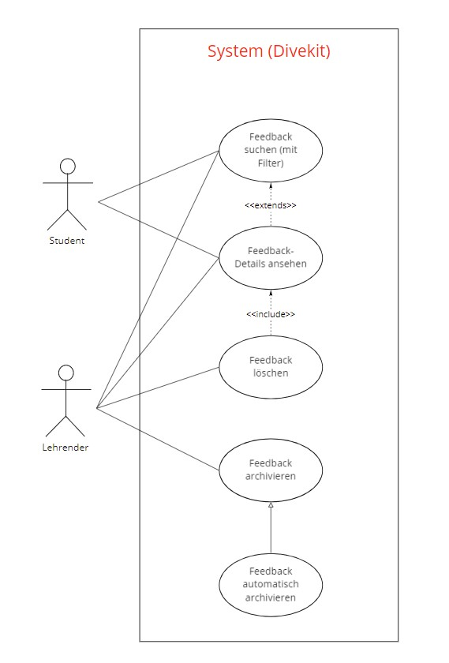

## Beschreibung

Das Use-Case Diagramm stellt mögliche Nutzungen des Systemteils "Feedback-Archiv" dar.

Das Feedback-Archiv besteht aus:
* Suche nach Feedback
  * Filtern von Feedback
  * Anzeige von Feedback
    * Bearbeitung / Löschen von Feedback
* Archivierung von Feedback

## Diagram

