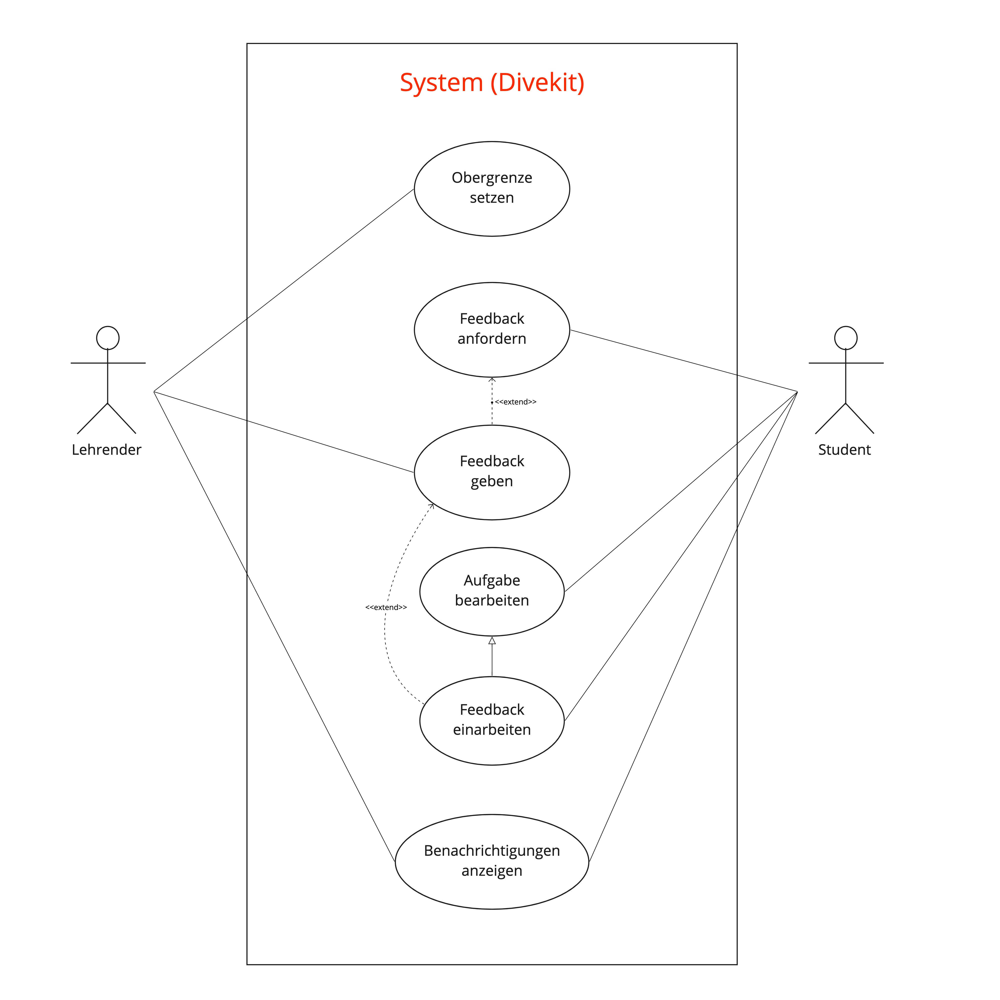

## Beschreibung

Die funktionale Anforderung „Obergrenze für Feedback setzen“ hängt von vielen anderen Prozessen ab.

Der Hauptanwendungsfall dieser Anforderung ist "Obergrenze setzen". Dies wird von einem Lehrenden ausgelöst.

Die Obergrenze wird für Anzahl von Feedback-Anfragen gesetzt, deswegen muss zuerst möglich sein Feedback anzufordern.
Dies wird vom Student ausgelöst. Der Lehrende kann auf die Anfrage antworten bzw. das Feedback geben.
Außerdem arbeitet der Student das Feedback ein, was ein Spezialfall von "Aufgabe bearbeiten" ist.
Sowohl der Student als auch der Lehrende werden über neue Feedback-Anfrage/-Antwort benachrichtigt.

## Diagram

