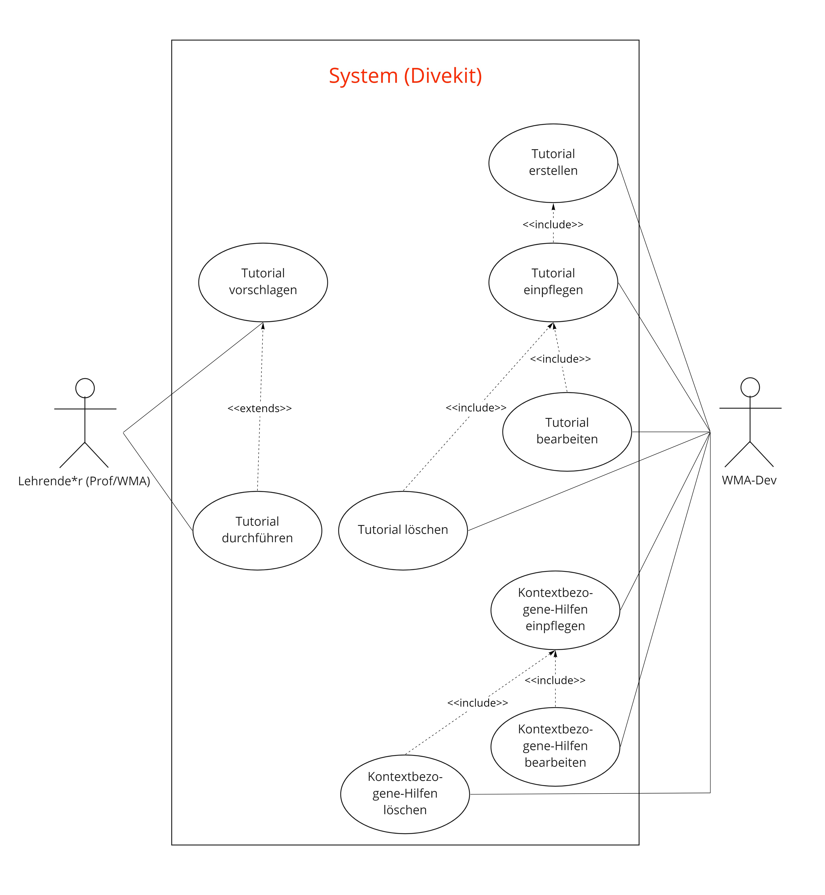

## Beschreibung

Das Use-Case Diagramm stellt mögliche Nutzungen des Systemteils "Schneller Lernprozess" dar.

Der schnelle Lernprozess besteht aus den folgenden Use Cases:
* Tutorial vorschlagen
* Tutorial einpflegen
* Tutorial bearbeiten
* Tutorial löschen
* Kontextbezogene-Hilfen darstellen
* Kontextbezogene-Hilfen einpflegen
* Kontextbezogene-Hilfen bearbeiten
* Kontextbezogene-Hilfen löschen

## Diagram

