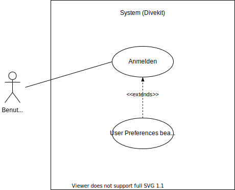

## Beschreibung

Der Ablauf um die User Preferences zu bearbeiten (siehe Anforderung "BereitstellungUserPreferences") wird dargestellt.

Der Use Case Anmelden ist Voraussetzung für das Bearbeiten der User Preferences. Ohne Benutzerkonto können auch keine
Benutzereinstellungen bearbeitet werden.

Der Use Case User Preferences Bearbeiten ist der Kern des FR. Er kann ausgeführt werden, nachdem der Benutzer sich eingeloggt
hat (daher extends). Er muss nicht notwendigerweise ausgeführt werden um andere Funktionen zu nutzen, er könnte sich aber
(je nach User Preferences) auf die Darstellung anderer Prozess auswirken (bswp. die Darstellungen für farbenblinde Nutzer).

## Diagram

